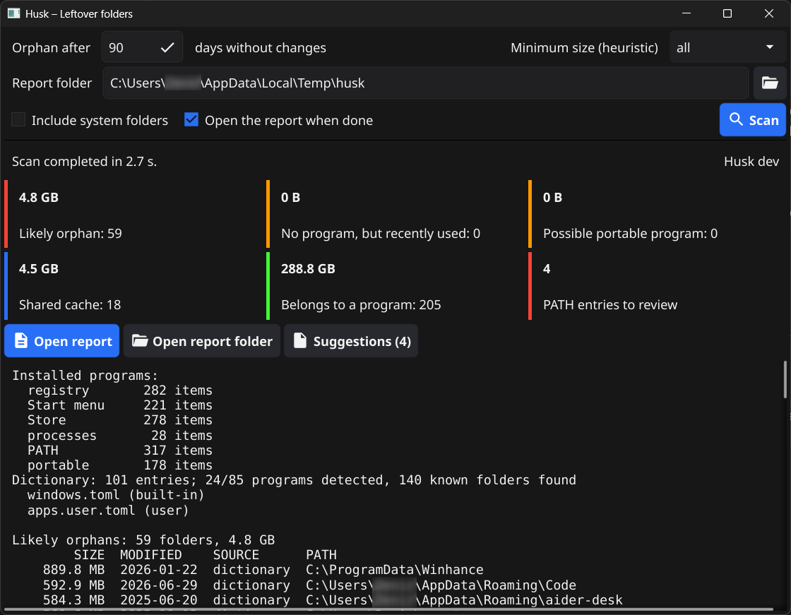

# Husk

Finds the folders left behind by uninstalled programs. Report only: nothing is ever deleted.
Windows, Linux, macOS. Two executables: `husk` (CLI) and `husk-gui` (Fyne). Version 0.1.1.



> **Disclaimer:** use at your own risk. Husk only reports what it finds, and its results can be wrong:
> always check a folder before deleting it. The authors accept no responsibility for any loss of data
> or damage resulting from the use of this software or of its reports.

## Requirements

- Go 1.24+
- `husk-gui` only: a C compiler (CGO) and, on Linux, the OpenGL/X11 development libraries

```bash
# Windows
winget install GoLang.Go
winget install BrechtSanders.WinLibs.POSIX.UCRT

# Debian/Ubuntu
sudo apt install golang gcc libgl1-mesa-dev xorg-dev libwayland-dev libxkbcommon-dev wayland-protocols

# macOS
xcode-select --install
brew install go
```

Open a new terminal after installing, then check:

```bash
go version
gcc --version
```

## Build

`scripts/build.sh` builds both programs into `dist/`, with the version from `internal/version/version.go`
and, on Windows, the icon and file details. The GitHub pipelines use the same script.

```bash
git clone https://github.com/goodmagma/husk.git
cd husk
go mod download
```

Windows (Git Bash; from PowerShell or cmd use `"C:\Program Files\Git\bin\bash.exe"` instead of `bash`,
not the WSL `bash`):

```bash
bash scripts/build.sh            # dist/husk.exe and dist/husk-gui.exe
bash scripts/build.sh cli        # only dist/husk.exe
bash scripts/build.sh gui        # only dist/husk-gui.exe (the first build takes a few minutes)
```

Linux and macOS:

```bash
bash scripts/build.sh            # dist/husk and dist/husk-gui
```

Other targets for the CLI (the GUI must be built on the target system):

```bash
GOOS=linux GOARCH=arm64 bash scripts/build.sh cli
GOOS=darwin GOARCH=arm64 OUT=dist/macos bash scripts/build.sh cli
GOOS=windows GOARCH=amd64 bash scripts/build.sh cli
```

Without the script, the equivalent `go` commands are:

```bash
# Windows
go build -trimpath -ldflags "-s -w" -o dist/husk.exe ./cmd/husk
go build -trimpath -ldflags "-s -w -H=windowsgui" -o dist/husk-gui.exe ./cmd/husk-gui

# Linux / macOS
go build -trimpath -ldflags "-s -w" -o dist/husk ./cmd/husk
go build -trimpath -ldflags "-s -w" -o dist/husk-gui ./cmd/husk-gui
```

Linux and macOS packages with desktop entry / `.app` bundle (as in the release):

```bash
go install fyne.io/tools/cmd/fyne@v1.7.2
fyne package --os linux --src cmd/husk-gui --release     # Husk.tar.xz
fyne package --os darwin --src cmd/husk-gui --release    # Husk.app
```

`fyne package` also bumps `Build` in `cmd/husk-gui/FyneApp.toml`: revert that change before committing.
Do not use it for Windows: the icon already comes from `cmd/husk-gui/rsrc_windows_*.syso`.

### Version and icon

The version is in `internal/version/version.go`, `cmd/husk-gui/FyneApp.toml` and
`cmd/*/winres/winres.json` (`file_version`, `product_version`, `FileVersion`, `ProductVersion`).
After changing them, or the icon, regenerate the assets and the Windows resources:

```bash
go run ./tools/svg2png assets/icon.svg assets/icon.png 256
go run ./tools/svg2png assets/icon.svg assets/icon-48.png 48
go run ./tools/svg2png assets/icon.svg assets/icon-32.png 32
go run ./tools/svg2png assets/icon.svg assets/icon-16.png 16
go run github.com/tc-hib/go-winres@v0.3.3 make --in cmd/husk/winres/winres.json --out cmd/husk/rsrc --arch amd64,arm64
go run github.com/tc-hib/go-winres@v0.3.3 make --in cmd/husk-gui/winres/winres.json --out cmd/husk-gui/rsrc --arch amd64,arm64
```

A one-off version can also be passed at build time: `VERSION=0.2.0-dev bash scripts/build.sh`.

## Usage

```bash
dist/husk                         # scan, print the report to stdout (progress on stderr)
dist/husk -v --show all           # every status, with match and notes
dist/husk --report                # also write the HTML/CSV files and open the HTML page
dist/husk --report --out report --no-open
dist/husk --help                  # all options: --days, --min-mb, --all, --workers, ...
```

Report files (`--report`): each scan creates a `husk_<date>_<time>` folder inside `--out`
(default: the system temp folder) with `husk_report.html`, `husk_report.csv`, `husk_programs.csv`,
`husk_path.csv` and `husk_suggestions.toml`.
`husk-gui` always writes them and shows the same text as the CLI in its log.

## Local configuration

- `dictionary/{windows,linux,darwin}.toml`: built-in dictionary, embedded in the executables.
- `apps.user.toml`, `ignore.txt`: personal entries and exclusions, read from the executable folder and from
  `%APPDATA%\husk` (Windows), `~/.config/husk` (Linux), `~/Library/Application Support/husk` (macOS).
  Not tracked in the repository.

## Checks

```bash
gofmt -l .
go vet ./...
go test ./...

# other systems: the GUI needs CGO, so it can only be checked on the target system
GOOS=linux go vet ./dictionary ./internal/... ./cmd/husk
GOOS=darwin go vet ./dictionary ./internal/... ./cmd/husk
```

## Release

GitHub Actions (`.github/workflows`):

- `ci.yml`: on every push to `main` and pull request, `gofmt`, `go vet`, `go test` and build on Windows, Linux, macOS.
- `release.yml`: on a `v*` tag, builds and publishes a GitHub release:
  - `husk_<version>_<os>_<arch>`: CLI for Windows, Linux and macOS (amd64, arm64);
  - `husk-gui_<version>_<os>_<arch>`: GUI for Windows amd64 (`.exe` with icon, built with
    `scripts/build.sh`), Linux amd64/arm64 (`.tar.xz` with desktop entry) and macOS amd64/arm64 (`.app`),
    both packaged with `fyne package`;
  - `SHA256SUMS.txt`.

  The version comes from the tag. A manual run (Actions → Release → Run workflow) builds the packages
  without publishing them.

```bash
git tag v0.1.1
git push origin v0.1.1
```

## Disclaimer

This software is provided "as is", without warranty of any kind, express or implied. Use it at your own
risk. The authors are not liable for any claim, damage or data loss arising from its use, including
the deletion of folders listed in its reports.
